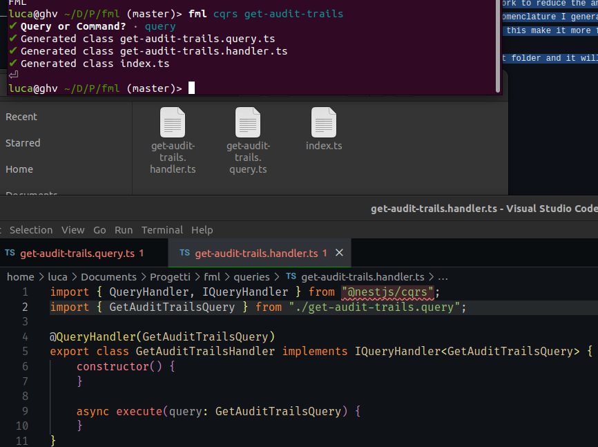

# fml 
fml is a boilerplate generator that I use in my day to day work to reduce the amount of time that I spend writing boilerplate code. In the current form this cli command generates CQRS command/query and all necessary classes for Nestjs while adhering to the nomenclature I generally use. With respect to other similar project this one uses [ts-morph](https://ts-morph.com/) to manipulate the Abstract Syntax Tree instead of using template substitution, this make it more feasible for more complex use cases where the boilerplate need to read variables and change existing classes.

This script can be used running "fml cqrs" inside the project folder and it will create the command/query class and it will expose it and import it in nestjs dependency injection.

